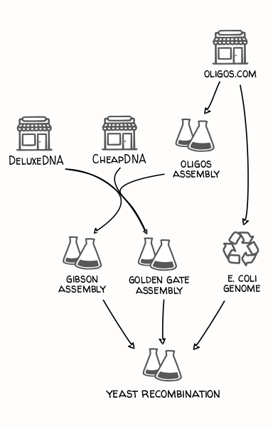
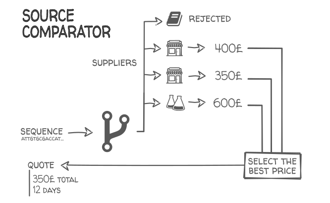

> _This is a bloggification of [these IWBDA 2019 slides]() on how path-finding tricks used in Google Maps and real-time strategy games can also help build long DNA molecules._

In my previous job at the Edinburgh Genome Foundry, customers would email us long DNA sequences (typically 10,000 or more nucleotides ATGC...) which we assembled from smaller DNA fragments with our robots:

This platform can assemble thousands of DNA fragments per day, but how do you find enough customers to feed the beast? How do you enable biologists worldwide to order DNA constructs as easily as you'd book a plane ticket?

One of our first projects, a collaboration with Autodesk, was a customer portal where users could design DNA sequences and order them from froundries:

The website was sunset before it could become the Skyscanner of large DNA, but we kept working on the quote generation part -- how to automatically analyse a customer's DNA sequence and determine the cheapest, fastest way that our foundry could build it. This is a problem every DNA provider has, but it becomes particularly difficult for longer sequences, which can be built in many, many ways.

## From parts, from scratch, from a mix-and-match

How you build long DNA sequences depends on your preferred DNA assembly techniques, your favorite DNA fragments providers, what DNA fragments you already have in stock, and how cheap and fast you want the whole project to be.

### From parts

You can build a DNA construct by fusing together standard genetic parts that you may already have in the fridge. The construct can then serve as a part for the next, higher order construct, and so on until you obtain the desired assembly:

This is cheap (since you already own the DNA building blocks, and they're easy to photocopy), fast (around one day per assembly, since the parts are designed to assemble easily), and the planning consists mainly in finding the best order in which to assemble the parts, possibly with the help of software like RavenCAD ():

### From scratch

Instead of relying on existing DNA parts, you can build completely new sequences from the bottom up. You start by synthesizing small _oligo_ DNA molecules of 40-100 nucleotides, one A,T,G,C at a time. From these oligos you assemble bigger fragments (1000 nucleotides), then fuse these fragments into even bigger blocks etc.

Whole genomes of million of nucleotides have been built this way. Each genome synthesis project generally has its own variations, and implements custom software to plan the thousands of assembly operations required (which are then performed by automated biofoundries or by armies of students and postdocs).

Here is a fully synthetic and re-designed XXX genome. Note that they didn't start from printed oligos, and instead ordered 1,000-nucleotide blocks from a company specialized in DNA printing:

### The whole spectrum in-between

Our customer's projects were rarely built entirely from parts or scratch, however, and would rather be a mix of DNA reuse and de-novo synthesis.

A typical example is the assembly of pre-existing genetic parts from a standard library with a gene that we would synthesized by one of our external vendor:

Some vendors are cheap but will only accept the "easy" sequences (count 100$ for a 1kb gene), some are more expensive but will really try and synthesize anything. All vendors have limits on the sequence size, and when the gene exceeds these limits we would order it in multiple fragments (sometimes from different providers) that would then be fused together during the assembly operation:

It's starting to look like an interesting computational problem! Let's throw in one more popular cloning technique: the PCR extraction. If the gene you want is from an organism you have in your freezer (for instance _E. coli_ bacteria), you can easily extract the gene by ordering two small oligos that match its starting and ending sequences, and will guide an enzyme to create copies of it from the organism's chromosome:

This method can get you 4,000-nucleotide genetic components for just a few dollars and a day of work! But what if the sequence naturally present is E. coli is almost the sequence you want, but with two little differences? In that case you would use a variant (called _site-directed mutagenesis_) in which you order 6 oligos, create 3 fragments of the gene with slighlty altered ending sequences, and fuse everything together:

### Many fabrics... and many stitches

Not only can DNA fragments come from many different sources, they can also be assembled in many ways. Golden Gate Assembly works very well but requires the sequence to be free on some sequences, such as "CGTCTC". Gibson Assembly can be used assemble most sequences but is sensitive to repeated patterns and prones to mutations. LCR assembly isn't prone to mutations and doesn't have any forbidden sequence, but is prone

### So yeah, it's complicated

The multitude of sources and assembly methods can make the planning of large DNA assemblies a hard combinatorial problem. For the most complex projects, some labs resort to planning councils, gathering all team members with DNA wisdom in a same room, putting the sequence on display, and getting everyone's input:

Even with some many scholars involved, errors can be made, better strategies can be missed. So how do you replace this meeting by a piece of software?

## Step 1: representing the problem

"I assemble sequences using Golden Gate assembly and I buy fragments from one of these vendors"

This variation means "I buy fragments from 3 possible vendors, but for a given sequence I want all fragments to come from the same vendor".

This one means "I assemble oligos into blocks, blocks into bigger blocks, etc."

And this one:

Here is one supply network representing both the standard PCR extraction, and site-directed mutagenesis.

I won't go into the details of how each but for the curious.

I wont go in the details but I spent a lot of time doing all these drawings

These blocks have pretty simple logics, with the notable exception of the assembly station, which has a central responsibility: finding the optimal decomposition of a DNA sequence into fragments that are easy to obtain and assemble together.

## Step 2: finding the right cuts

Here is an illustration of the difference, from the [A\* wikipedia page](https://en.wikipedia.org/wiki/A*_search_algorithm) (courtesy of user [Subh83](https://en.wikipedia.org/wiki/User:Subh83?rdfrom=commons:User:Subh83)).

## A few more shortcuts

<table>
  <tr>
    <th>Dijsktra algorithm</th>
    <th>A* algorithm</th>
  </tr>
  <tr>
    <td width:50%>
      
    </td>
    <td>
      
    </td>
  </tr>
</table>
