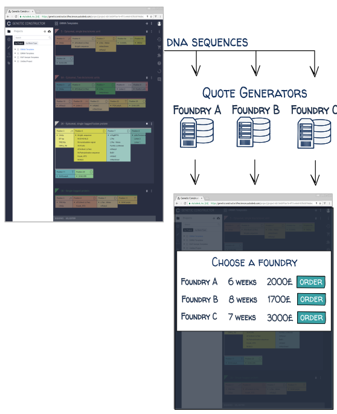

> _This is a bloggification of [these IWBDA 2019 slides]() on how path-finding tricks used in Google Maps and real-time strategy games can also help build long DNA molecules._

In my previous job at the Edinburgh Genome Foundry, customers would email us long DNA sequences (typically 10,000 or more nucleotides ATGC...) which we assembled from smaller DNA fragments with our robots:


This platform can assemble thousands of DNA fragments per day, but how do you find enough customers to feed the beast? How do you enable biologists worldwide to order DNA constructs as easily as you'd book a plane ticket?

One of our first projects, a collaboration with Autodesk, was a customer portal where users could design DNA sequences and order them from froundries:



The website was sunset before it could become the Skyscanner of large DNA, but the quote generation part (how to automatically analyse a customer's DNA sequence and determine the cheapest, fastest way that our foundry could build it) remained a hot topic. This is a problem every DNA provider has, but it becomes particularly difficult for longer sequences, which can be built in many, many ways.

## From parts, from scratch, and everything in-between

How you build long DNA sequences depends on your preferred DNA assembly techniques, your favorite DNA fragments providers, what DNA fragments you already have in stock, and how cheap and fast you want the whole project to be.

### Parts assembly projects

You can build a DNA construct by fusing together standard genetic parts that you may already have in the fridge. The construct can then serve as a part for the next, higher order construct, and so on until you obtain the desired assembly:


This is cheap (since you already own the DNA building blocks, and they're easy to photocopy), fast (around one day per assembly, since the parts are designed to assemble easily), and the planning consists mainly in finding the best order in which to assemble the parts, possibly with the help of software like RavenCAD ():


### Synthesis from scratch

Instead of relying on existing DNA parts, you can build completely new sequences from the bottom up. You start by synthesizing small _oligo_ DNA molecules of 40-100 nucleotides, one A,T,G,C at a time. From these oligos you assemble bigger fragments (1000 nucleotides), then fuse these fragments into even bigger blocks etc.


Whole genomes of million of nucleotides have been built this way. Each genome synthesis project generally has its own variations, and implements custom software to plan the thousands of assembly operations required (which are then performed by automated biofoundries or by armies of students and postdocs).

Here is a fully synthetic and re-designed XXX genome. Note that they didn't start from printed oligos, and instead ordered 1,000-nucleotide blocks from a company specialized in DNA printing:


### Bit-of-both assembly projects

Our customer's projects were rarely built entirely from parts or scratch, however, and would rather be a mix of DNA reuse and de-novo synthesis.

A typical example is the assembly of pre-existing genetic parts from our standard library with a gene that would be synthesized by one of our external vendor:


Some vendors are cheap but will only accept the "easy" sequences (count 100$ for a 1kb gene), some are more expensive but will really try and synthesize anything. All vendors have limits on the sequence size, and when the gene exceeds these limits we would order it in multiple fragments (sometimes from different providers) that would then be fused together during the assembly operation:


It's starting to look like an interesting computational problem! Let's throw in one more popular cloning technique.

If the gene you want is from an organism you have in your freezer (for instance _E. coli_ bacteria), you can easily extract the gene via _PCR extraction_, by ordering two small oligos that match its starting and ending sequences, and will guide an enzyme to create copies of it from the organism's chromosome:


This method can get you 4,000-nucleotide genetic components for just a few dollars and a day of work! But what if the sequence naturally present is E. coli is almost the sequence you want, but with two little differences?

In that case you would use a variant (_site-directed mutagenesis_) where you order 6 oligos to create 3 fragments with slighlty altered sequences, and fuse everything together:


### Selecting a stitch

Not only can DNA fragments come from many different sources, they can also be assembled in many ways, for instance with Golden Gate Assembly, Gibson Assembly, LCR assembly (to only quote some of the most popular):


These methods vary in how many sequence fragments can be assembled together, which sequence patterns they are sensitive to (repeats, secondary structures, homologies), which fragments and oligos must be ordered, etc.

### So yeah, it's complicated

The multitude of sources and assembly methods can make the planning of large DNA assemblies a hard combinatorial problem. For the most complex projects, some labs resort to planning councils, gathering all team members with DNA wisdom in a same room, putting the sequence on display, and getting everyone's input:


Even with some many scholars involved, errors can be made, better strategies can be missed. So how do you replace this meeting by a piece of software?

## Step 1: representing the problem

My favorite way to model DNA assembly problems is supply networks. Here is one corresponding to the scenario _"I can build DNA constructs via Golden Gate assembly of fragments either bought from vendor CheapDNA, or assembled from oligos"_:


While DNA fragments flow top to bottom in the network, information flows bottom to top: the Golden Gate station will ask CheapDna and Oligo Assembly _"I need this fragment, which of you can produce it and for which price?"_, CheapDNA will compute a price based on its pricing policy (for instance 10c per basepair). Oligo Assembly will ask its own provider, Oligos.com, how much the oligos necessary for the fragment's construction will cost, adds the cost of the oligo fusion, and returns the total price. The Golden Gate station then retains the lower bidder of the two.

Here are some more detailed schemas of how different sources of DNA may respond to a fragment request:


While the best way to define a detailed supply network might be a Python script, I also made a toy web application at some point that lets you build a supply network and submit a sequence to build:


The interesting
This variation means "I buy fragments from 3 possible vendors, but for a given sequence I want all fragments to come from the same vendor".

This one means "I assemble oligos into blocks, blocks into bigger blocks, etc."

And this one:

Here is one supply network that can be used for PCR extraction and and site-directed mutagenesis.

These blocks have pretty simple logics, with the notable exception of the assembly station, which has a central responsibility: finding the optimal decomposition of a DNA sequence into fragments that are easy to obtain and assemble together. And that's an interesting problem.

## Step 2: finding the right cuts

Here is a minimal example in Python, where a sequence is decomposed so that fragments will be either purchased (at 10c per basepair) or obtained from the fridge for free:

```python
import networkx as nx

def decompose_sequence(sequence, free_sequences, basepair_cost=0.1):
    def cost(seq):
        return 0 if seq in free_sequences else basepair_cost * len(seq)
    graph = nx.DiGraph([
        (i, j, {"cost": cost(sequence[i:j])})
        for i in range(len(sequence))
        for j in range(i + 2, len(sequence))
    ])
    path = nx.shortest_path(graph, 0, len(sequence) - 1, weight='cost')
    return [
        dict(segment=(i, j), sequence=sequence[i: j], cost=graph[i][j]['cost'])
        for i, j in zip(path, path[1:])
    ]

decompose_sequence(
    sequence = "ATTCTACTAAATTTGCACTCAGAGAGAACCATTA",
    free_sequences = ["AAATTT", "GAGAGA", "GGCCC"]
)
# >>> [{'segment': (0, 8),   'sequence': 'ATTCTACT', 'cost': 0.8 },
#      {'segment': (8, 14),  'sequence': 'AAATTT',   'cost': 0   },
#      {'segment': (14, 21), 'sequence': 'GCACTCA',  'cost': 0.7 },
#      {'segment': (21, 27), 'sequence': 'GAGAGA',   'cost': 0   },
#      {'segment': (27, 33), 'sequence': 'ACCATT',   'cost': 0.6 }]
```

The shortest path trick is one of my favorite computational stunts, but I can't be sure to be the first or only to come up with it. California-based DNA vendor [Twist Bioscience]() has been recruiting developers with [graph theory skills](https://www.smartrecruiters.com/TwistBioscience/84826182-python-software-engineer-algorithm), and Venice-based Doulix tweeted what seems to be a graph-based assembly optimization (and they may even have nailed circular assemblies):

<div style="max-width:500px; margin: 0 auto;"></div>

The interesting thing with the graph-based method is how well they can be adapted to solve a variety of problems.

### Cloning constraints as graph operations

- _"My assembly method doesn't work with fragments longer than X or shorter than Y"_: just remove all edges in the graph which are longer than X and shorter than Y.
- _"This assembly method works badly when the fragment fusion regions contain very low GC or repeated sequences"_: remove the graph nodes corresponding to such regions.
- _"The assembly method works badly when assembly more than 10 parts"_: put a constant penalty on each edge to reduce the number of edges in the shortest path.
  _"Golden Gate assembly overhangs should all be inter-compatible"_ (read this other article on the subject): If the assembly corresponding to the shortest path has imcompatible overhangs, use the XXX algorithm to iterate through the 2nd-shortest-path, 3rd, 4th, etc. until one assembly has compatible overhangs.
- _"Oligo assembly only works with an even number of fragments"_ I actually don't have an elegant solution for this one, but [here is a stackoverflow suggestion](https://stackoverflow.com/questions/32722448/shortest-path-with-even-number-of-edges) for finding even-edged shortest path via an heavy transformation of the graph.

### A\* Acceleration

The Dijkstra shortest-path algorithm is great, but may take a few minutes or even an hour to decompose the longest sequences, because of all the edges to evaluate. This makes it good enough for a foundry's planning, but too slow to give your customers the flight-booking experience.

Finding a route on a flight-booking website, like finding an itinerary for a Google Maps user or an Age of Empires army, is the kind of path finding problem where a solution but be found quickly, and it's fine to miss the absolute best route from time to time. These problems use the A\* algorithm, a path-finding refinement that gets fed an additional magic piece of imformation that it will use to cut down some of the exploration.

Here is an illustration of the difference, from the [A\* wikipedia page](https://en.wikipedia.org/wiki/A*_search_algorithm) (courtesy of user [Subh83](https://en.wikipedia.org/wiki/User:Subh83?rdfrom=commons:User:Subh83)).

<table>
  <tr>
    <th>Dijsktra algorithm</th>
    <th>A* algorithm<br/>50% space exploration, +10% longer path</th>
  </tr>
  <tr>
    <td width:50%>
      
    </td>
    <td>
      
    </td>
  </tr>
</table>

In a Google Maps search, the magic piece of information could be the average speed that the public transportation allows. In the special case of DNA sequence decomposition for assembly, that would be how the averag DNA source charges per basepair. If you get it too low, the search ressembles the Djikstra search (no speed gain), if you get it too high, every solution will appear cheap, the search will be rushed and naive. If you get it just right, you get quick and accurate assembly plans. The algorithm will understand that Parts Libraries and PCR extraction stations are like low-cost companies (they can get you far for cheap, as long as you agree with the take off and landing sites), oligo assembly is like walking (not cheap, not fast, but sometimes your only option), expensive companies are like taxicabs, etc.
By combining the A\* algorithm

# Conclusion

Looking back at this giant wall of text, it is pretty clear that:

- I can't meme!
- Part libraries are the Ryan Air of DNA construction.
- Decision-automating software is cool and every foundry should have as much as possible (and I'm not saying that as a foundry software person).
