---

> _**Note:** This is a bloggification of [these IWBDA 2019 slides](https://github.com/Edinburgh-Genome-Foundry/egf-shared-documents/blob/master/slideshows/dnaweaver_presentation_iwbda_2019/talk_long.pdf) on how path-finding tricks used in Google Maps and strategy games can also help build long DNA molecules._

---

<br/>

Story time! The Edinburgh Genome Foundry, where I worked a few years, is a platform that sells custom synthetic DNA. Customers email long sequences (`ATGCTAC...`, typically 10,000 bases or longer) which an automated setup will produce, generally by assembling smaller DNA fragments into bigger ones.

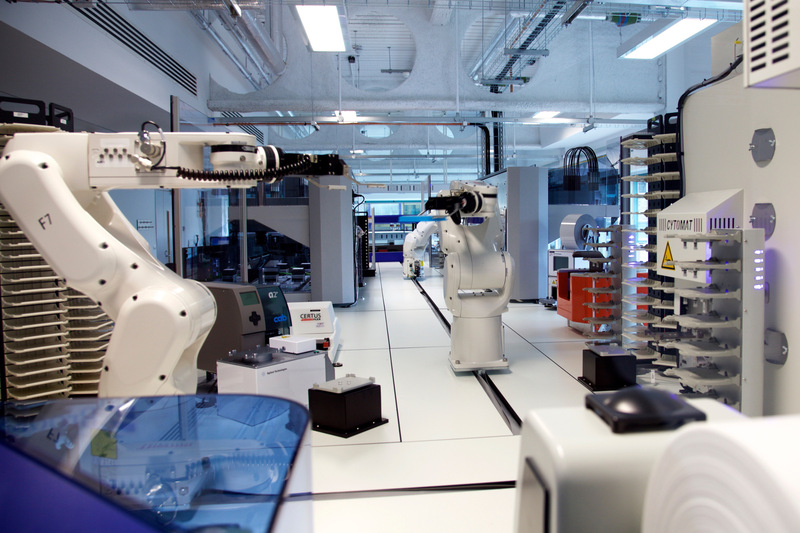

The platform can assemble thousands of DNA fragments per day, but how do you channel enough projects to feed the beast? How do you enable biologists worldwide to order DNA constructs as easily as they would order dinner or a plane trip?

One of our first software projects, a collaboration with <a href='https://www.autodesk.com/' target='_blank'> Autodesk</a> , was a customer portal where users could design DNA sequences and order them from different froundries:

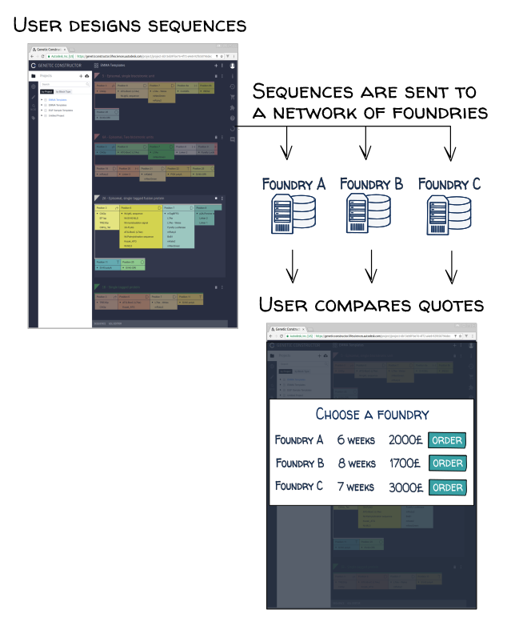

The website was sunset by Autodesk before it could become the Skyscanner of large DNA, and while it is <a href='https://github.com/Autodesk/genetic-constructor-ce' target='_blank'> open-source</a> we never had the infrastructure nor the bandwidth to pick it up. Customers would just have to design their sequences with classic software like <a href='https://www.benchling.com/' target='_blank'> Benchling</a>, <a href='https://www.snapgene.com/' target='_blank'>SnapGene</a>, or more likely Microsoft Word (<a href='https://github.com/Edinburgh-Genome-Foundry/crazydoc' target='_blank'>no kidding</a>).

But the quote generation problem, or _"how to automatically analyse a customer's DNA sequence and determine the cheapest, fastest way our foundry could build it"_ remained a hot topic. Assessing and planning large DNA construction projects manually can take weeks, and some customers don't have the patience. This is particularly true for longer sequences, as these can be built in many, many ways.

## From parts, from scratch, from snatch

How you build long DNA sequences depends on your preferred DNA assembly techniques, which DNA fragments providers you trust, what DNA fragments you already have in stock, what organisms you could snatch DNA from, and how cheap and fast you want the whole project to be.

### Parts assembly projects

The easiest scenario is when customers require sequences that are made up of _standard genetic parts_. These parts are often easy to find (laboratories near you may have them in their fridge if you don't already), easy to replenish miniprep, and designed to easily clip together into a construct. Sometimes this construct is used as a part for a subsequent, higher order construct, and so on until you obtain the desired assembly.

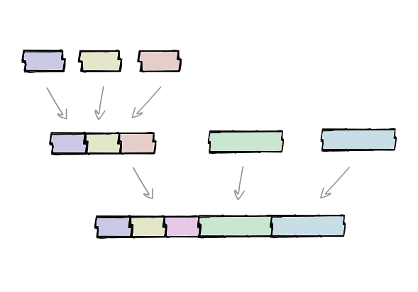

This is cheap, reliable, fast (around one day per assembly), and the planning consists mainly in finding the best order in which to assemble the parts, which can be aided by software solutions like <a target='_blank' href='https://www.cidarlab.org/raven'> RavenCAD </a>:

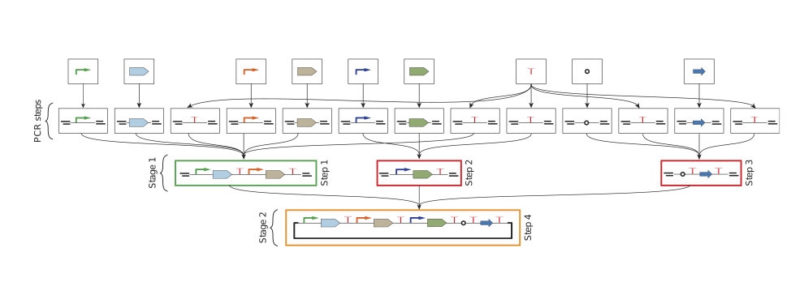

### Synthesis from scratch

DNA sequences that are completely novel can be assembled from the bottom up. You start from _oligos_, small DNA molecules of 40-100 nucleotides synthesized one nucleotide at a time. From these oligos you assemble bigger fragments (1000 nucleotides), then fuse these fragments into even bigger blocks etc.

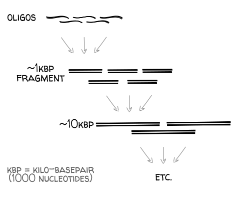

Whole synthetic genomes of hundreds of thousands (and soon millions) of nucleotides are built this way. Each synthesis project has its particularities, and implements custom software to plan the thousands of assembly operations required (which are then performed either by automated biofoundries or by armies of students and postdocs).

Here is a fully synthetic and re-designed _Caulobacter crescentus_ genome by <a href='https://pubmed.ncbi.nlm.nih.gov/28531174/' target='_blank'>Christen et al.</a>. Note that they didn't start from printed oligos, and instead ordered 1,000-nucleotide blocks from a company specialized in DNA printing:

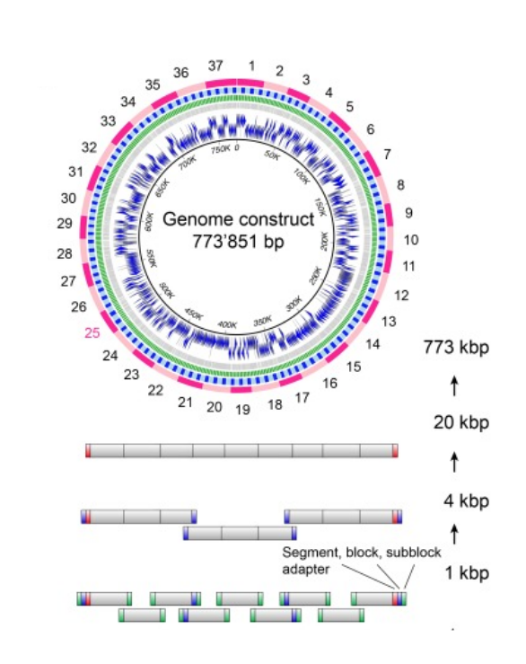

### Bit-of-both assembly projects

Our customer's projects were rarely built entirely from parts, or entirely or scratch, but rather from a mix of DNA reuse and de-novo synthesis. A typical example is the assembly of pre-existing genetic parts from a standard library, with a gene that would be synthesized by one of our external vendor:

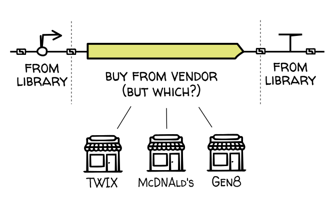

Some vendors are cheap (count 100$ for a 1000-nucleotide gene) but will only accept "easy" sequences, others will be up to twice more expensive, but will really try and synthesize anything you throw at them.

All vendors have limits on the sequence size they'll accept, and so we would order the longest sequences in multiple smaller fragments (sometimes from different providers) that would then be fused together, possibly at the same time as the other parts:

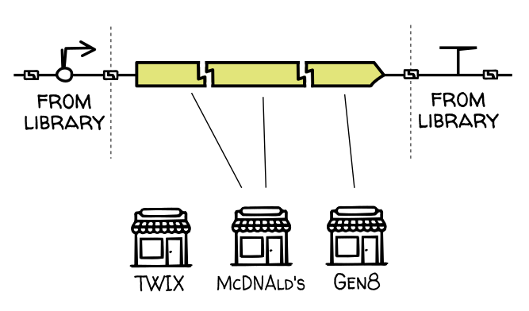

It's starting to look like an interesting computational problem! Let's throw in one more popular cloning technique.

If the gene you want is from an organism you have in your freezer (for instance _E. coli_ bacteria), you can easily extract the gene via _PCR extraction_, by ordering two small oligos that match its starting and ending sequences, and will guide an enzyme to create copies of it from the organism's chromosome:

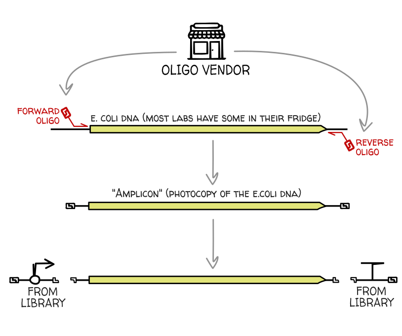

This method can get you 4,000-nucleotide genetic components for just a few dollars and a day of work! But what if the sequence naturally present is E. coli is only _almost_ the sequence you want, but with two different nucleotides?

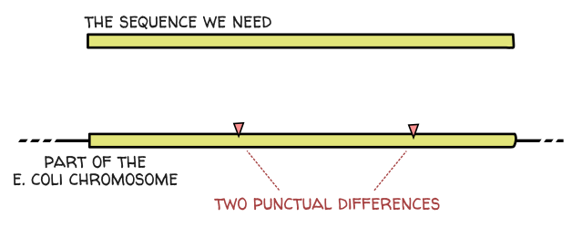

In that case you would use a protocol called _site-directed mutagenesis_ where you order 6 oligos to create 3 fragments with slighlty altered sequences, and fuse everything together:

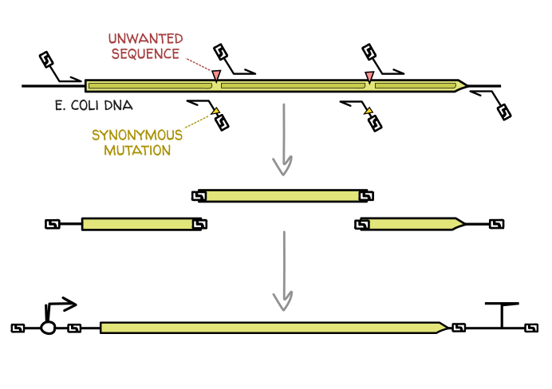

### Selecting a stitch

Not only can DNA fragments come from many different sources, they can also be fused together in different ways. Here are schematics of Golden Gate Assembly, Gibson Assembly, and LCR assembly, to only show a few:

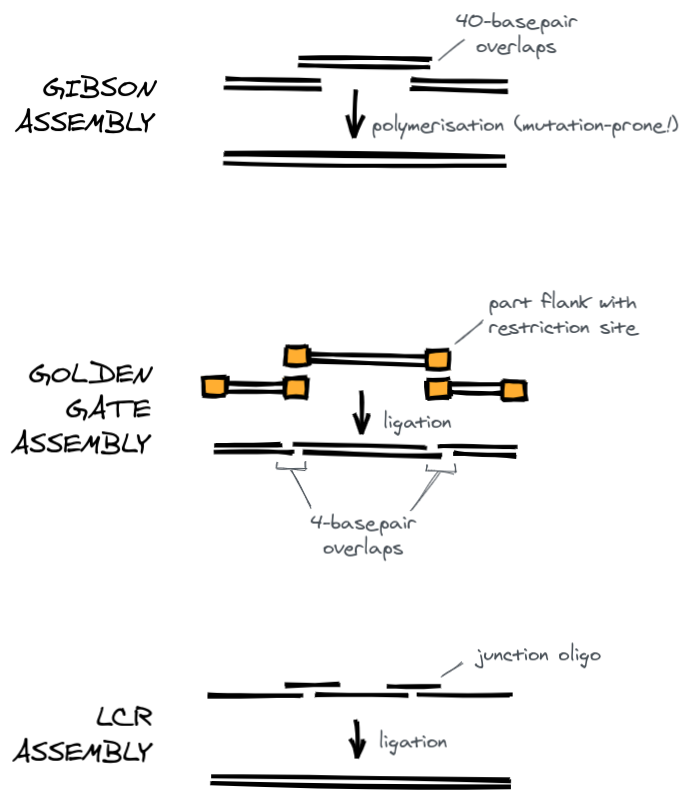

These methods vary in how many sequence fragments they can assemble at once, which sequence patterns will cause problems (repeats, secondary structures, homologies), which fragments and oligos sequences must be ordered, etc.

### So yeah, it's complicated

The multitude of sources and assembly methods can make the planning of large DNA assemblies a hard combinatorial problem. I've seen meetings for complex projects where everyone with DNA wisdom is gathered in a same room, the sequence(s) to build put on display, and it goes a bit like this:

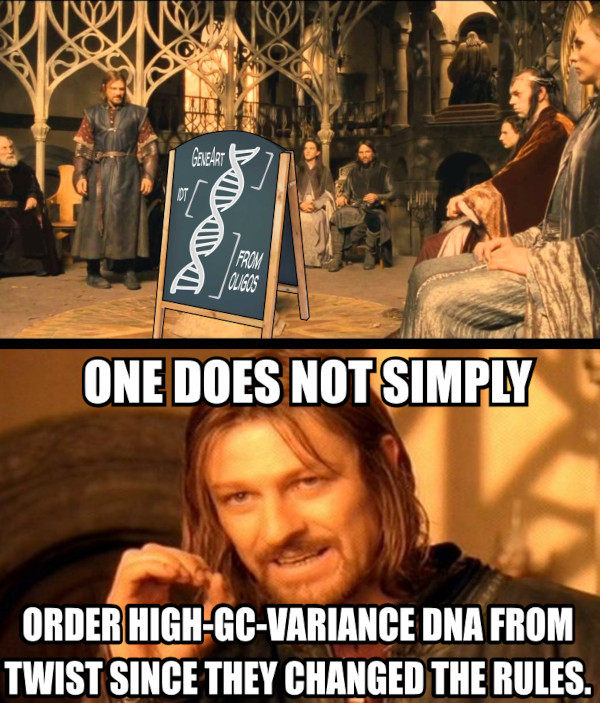

Even with many experts in the room, errors can be made, and workload estimations can be wrong. So how do you replace this meeting by software?

## Step 1: representing the problem

The best way I found to represent DNA assembly problems is _supply networks_, which show the flow of DNA fragments from the original sources and providers to the final construct. Here is the supply network for _"I can build DNA constructs via Golden Gate assembly of fragments either bought from vendor CheapDNA, or assembled from oligos"_:

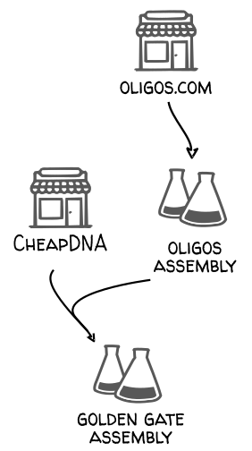

While DNA fragments flow top to bottom in the network, DNA requests flow bottom to top: the Golden Gate assembly station asks _CheapDna_ and _Oligo Assembly_ _"I need this fragment, which of you can produce it and for which price? I'll go with the cheapest."_, and both providers will come back with their best offer. CheapDNA determines the price based on a pricing policy (for instance 10c per basepair), while Oligo Assembly first asks its own provider _Oligos.com_ for oligo prices, before adding the cost of the oligo fusion operation.

Here are some more detailed schemas of how different sources of DNA may respond to a fragment request:

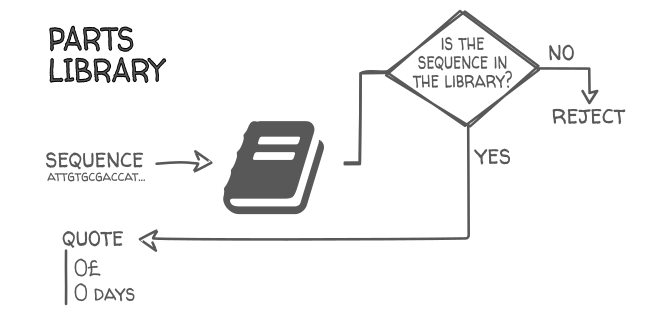
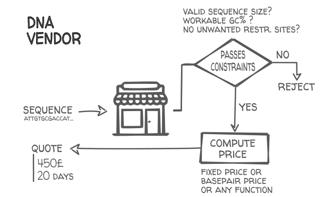
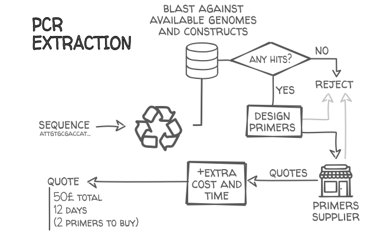
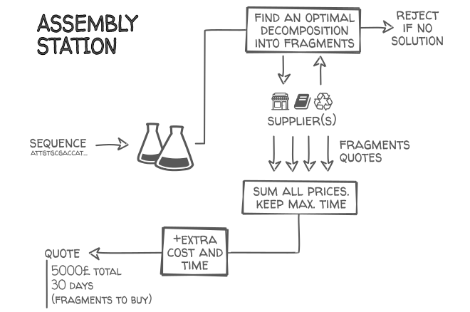

Supply network are generally modeled using a Python script (<a href='https://github.com/Edinburgh-Genome-Foundry/galaxy_synbiocad_dnaweaver/blob/master/methods/generate_supply_network.py' target='_blank'>example</a>), but I also made a toy <a target='_blank' href='https://dnaweaver.genomefoundry.org/#/'>web application</a> (ever a toy) that lets you build a supply network and submit a sequence to build:

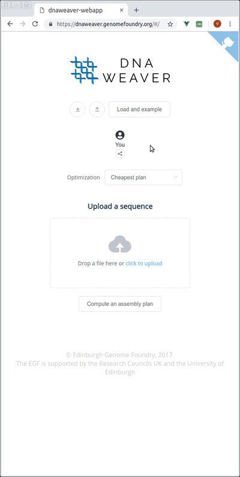

Here are some screenshots of the app's output, showing a suggested assembly plan and a shopping list of parts and oligos to buy (part sequences are in a separate spreadsheet):

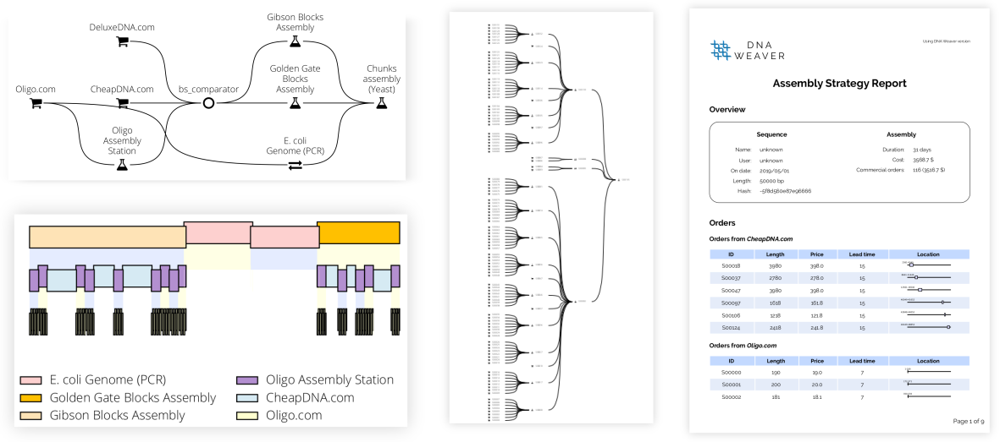

The main advantage of supply networks is how easily they can represent common scenarios. Here is _"I assemble DNA via Gibson Assembly and I have 3 vendors to buy fragments from"_.

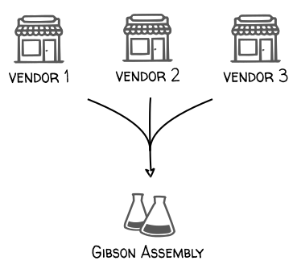

With the schema above, each DNA fragment may come from a different vendor, which is not ideal (it's a lot of paperwork!). Here is a variation meaning _"I have 3 vendors to choose from, but all fragments will come from the vendor which can deliver all fragments for the lowest total price"_.

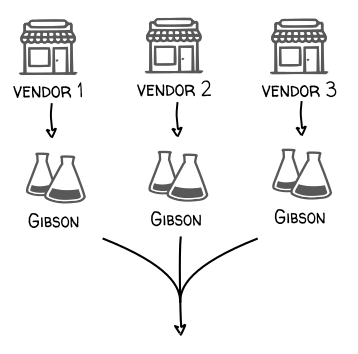

Here is _"I assemble long DNA molecules from scratch in several steps, starting with oligos I order."_

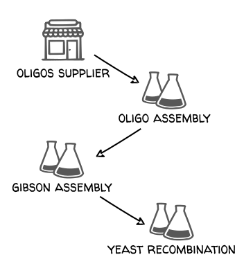

Here is the supply network for site-directed mutagenesis, described earlier:

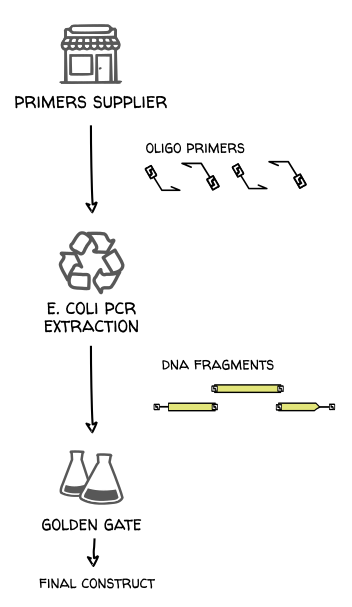

Finally, here is _"I use yeast recombination to assemble big fragments, which I obtain via E. coli PCR, or by Golden Gate or Gibson Assembly of smaller fragments obtained from DeluxeDNA, CheapDNA, or oligo assembly"_. You get the idea.

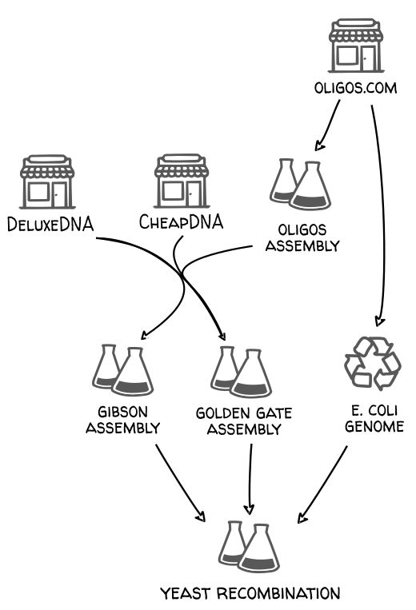

So it is possible to represent the most common DNA assembly problems via networks of DNA suppliers following mostly simple internal logics. The one nodes of this network that will require complex internal logics are assembly stations, who have the central responsibility of decomposing the requested sequence into fragments that will as cheap as possible to produce by their sources. How do they do it?

## Step 2: finding the right cuts

Given a set of DNA sources (vendors, libraries, PCR extraction...) and a given sequence to assemble, which sequence fragments should be ordered, and from which sources ? After all, there are trillions of ways of decomposing a sequence into fragments:

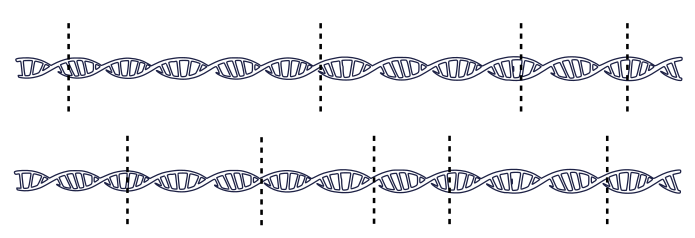

There have been many approaches to this problem, using deterministic algorithms, genetic algorithms, etc., but these approaches generally explore only a small fraction of the possibilities. The most efficient solution I found consists in representing the question as a graph shortest-path problem. First, take a segment of the sequence, and add whichever flanks required by your assembly method (homologies with neighboring sequences, restriction sites...) to obtain the fragment to order:

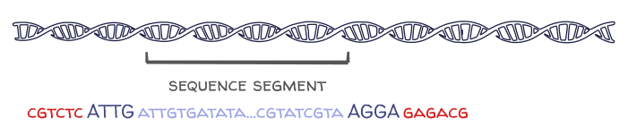

Then submit this fragment to all the suppliers to obtain a best offer. Mark the segment with that price (and remember who the best supplier is):

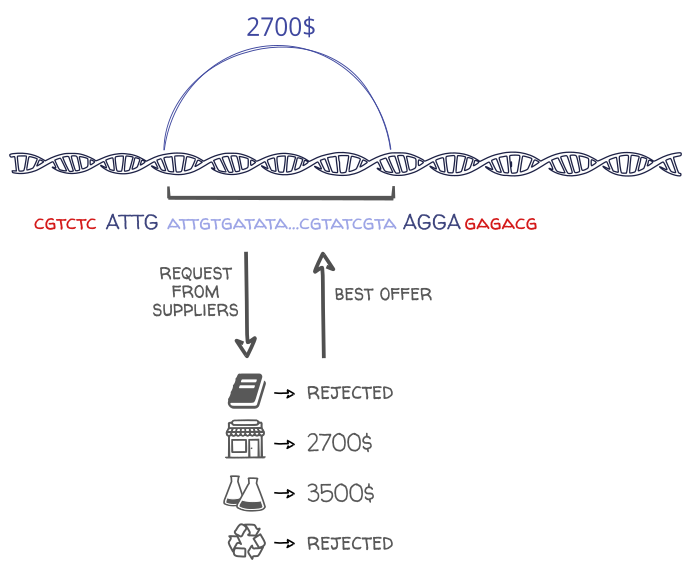

Do the same for every subsegment of the sequence, to obtain the _decomposition graph_ of the sequence:

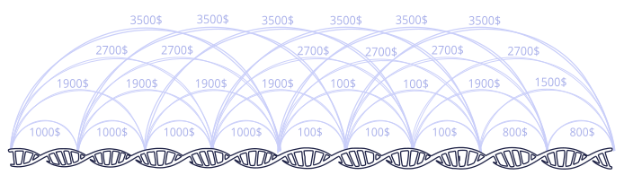

In that graph, find the shortest path from the first to the last nucleotide: it corresponds to the optimal sequence decomposition into fragments. All you need at this point is to remember the best supplier for each fragment:

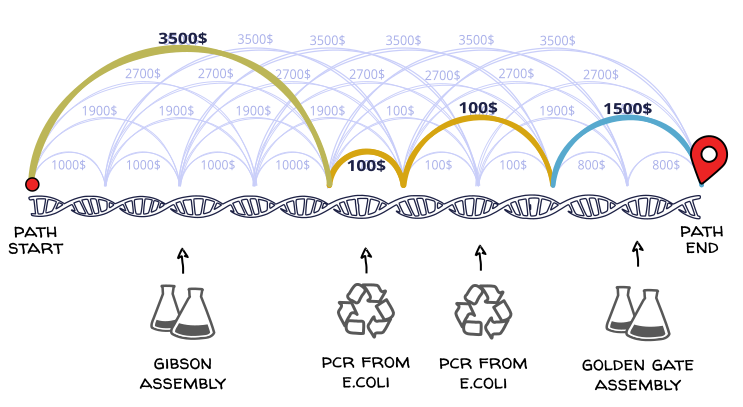

This method very easy to code, as most graph libraries implement the Dijkstra shortest-path algorithm. Here is a minimal example in Python (using the <a href='https://networkx.org/' target='_blank'>Networkx</a> framework) where a sequence is decomposed so that fragments will be either purchased (at 10c per nucleotide) or obtained from the fridge for free:

```python
import networkx as nx

def decompose_sequence(sequence, free_fragment_sequences, basepair_cost=0.1):
    def cost(subsequence):
        if subsequence in free_fragment_sequences:
            return 0
        else:
            return basepair_cost * len(subsequence)
    graph_edges = [
        (i, j, {"cost": cost(sequence[i:j])})
        for i in range(len(sequence))
        for j in range(i + 2, len(sequence) + 1)
    ]
    graph = nx.DiGraph(graph_edges)
    path = nx.shortest_path(graph, 0, len(sequence), weight='cost')
    return [
        dict(segment=(i, j), sequence=sequence[i: j], cost=graph[i][j]['cost'])
        for i, j in zip(path, path[1:])
    ]

decompose_sequence(
    sequence = "ATTCTACTAAATTTGCACTCAGAGAGAACCATTA",
    free_fragment_sequences = ["AAATTT", "GAGAGA", "GGCCC"]
)
# Result:
# >>> [{'segment': (0, 8),   'sequence': 'ATTCTACT', 'cost': 0.8 },
#      {'segment': (8, 14),  'sequence': 'AAATTT',   'cost': 0   },
#      {'segment': (14, 21), 'sequence': 'GCACTCA',  'cost': 0.7 },
#      {'segment': (21, 27), 'sequence': 'GAGAGA',   'cost': 0   },
#      {'segment': (27, 33), 'sequence': 'ACCATT',   'cost': 0.6 }]
```

This shortest-path trick is one of my proudest computational stunts, but I can't be certain to have been the first to use it. California-based DNA vendor Twist Bioscience has been <a target='_blank' href='https://www.smartrecruiters.com/TwistBioscience/84826182-python-software-engineer-algorithm'>recruiting developers with graph theory skills</a> years ago, and more recently Italy-based Doulix published this tweet which really looks like graph-based assembly optimization (and they may even have nailed circular shortest paths to assemble plasmids!).

<div style="width:500px; max-width: 100%; margin: 1.5cm auto 1.5cm;"></div>

Finally, a Github search gave me <a target='_blank' href='https://github.com/jvrana/DASi-DNA-Design'>this project</a> from the University of Washington which also uses shortest path algorithms, and integrates with other lab automation software. It's a nice tribute to applied maths that different groups through the world came up with the same abstraction of a pretty recent problem.

### Cloning constraints as graph operations

The great thing with the graph representation of the DNA construction problem is how you can model practical cloning constraints with simple operations:

- _"My assembly method doesn't work with fragments shorter than X or longer than Y"_: just remove all graph edges spanning more than Y or less than X.

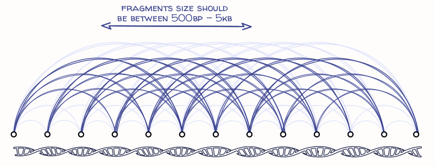

- _"This assembly method works badly when the fragment fusion regions contain very low GC or repeated sequences"_: remove the graph nodes corresponding to such regions.

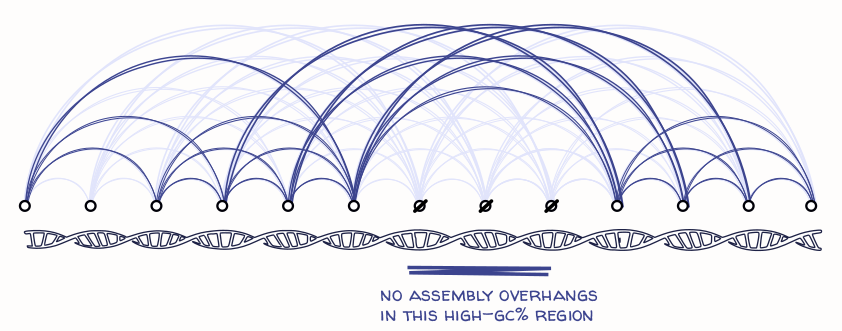

- \_"For future projects, I'll need to force the junction between two fragments to absolutely happen at a

- _"The assembly method works badly when assembly more than 10 parts"_: if the shortest path has more than 10 edges, add a constant penalty weight to each edge, and compute the new shortest path, which should have less edges. Increase the penalty if necessary.

- _"Golden Gate assembly overhangs should all be inter-compatible"_ (read <a target='_blank' href='https://zulko.github.io/bricks_and_scissors/posts/overhangs/'>this other article on that subject</a>): If the assembly strabtegy correspondings to the shortest path has DNA fragments with imcompatible overhangs, use a backtracking algorithm (Yen 1971, as [implemented in Networkx](https://networkx.org/documentation/networkx-1.10/reference/generated/networkx.algorithms.simple_paths.shortest_simple_paths.html#id2)) to iterate through the 2nd-shortest-path, 3rd, 4th, etc. until one assembly has compatible overhangs.

- _"Oligo assembly only works with an even number of fragments"_ -- I actually don't have an elegant solution for this one, but [here is a stackoverflow suggestion](https://stackoverflow.com/questions/32722448/shortest-path-with-even-number-of-edges) for finding even-edged shortest path via an heavy transformation of the graph.

### Harder, faster, ~~stronger~~: the A-star algorithm

One bottleneck of the graph representation approach is that large sequences (from tens of thousands of nucleotides) will require to cost millions of edges, which will take a few minutes. This is generally acceptable for foundry operators, given the reward, but too slow to give web customers the instantaneous, flight-booking-like experience that will keep them asking for prices as they tweak their DNA designs.

A solution to this is _A\*_, another shortest-path algorithm which can just ignore most edges of the graph if they look unlikely to be part to the optimal solution. It may sometimes be wrong, and miss the best path, but it is a very good approximator.

Here is an illustration (from user user <a target='blank' href='https://en.wikipedia.org/wiki/User:Subh83?rdfrom=commons:User:Subh83'>Subh83</a> on the <a href='https://en.wikipedia.org/wiki/A*_search_algorithm' target='_blank'>A\* wikipedia page</a> where _A\*_ finds a similar path that is only 10% longer path by exploring 50% less edges:

<table style='display: block; margin: 4em auto 4em; width: 500px; max-width: 100%;'>
  <tr>
    <th style='text-align: center'>Dijsktra algorithm</th>
    <th style='text-align: center'>A* algorithm</th>
  </tr>
  <tr>
    <td style='width:50%'>
      
    </td>
    <td style='width:50%'>
      
    </td>
  </tr>
</table>

The speed and good approximation make A\* a good choice for interactive applications, and it has been used for real-time strategy games such as Age of Empire, which require to move many units through the map without any lag:

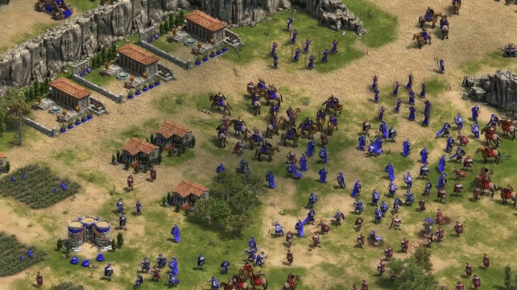

A\* is so good at ignoring graph edges because it is fed a particular piece of information from which it will evaluate, at any point of the search, how far it is from its goal. For the illustration above, the information may be the geometric distance to the goal divided by the average terrain speed. If you are looking for the fastest trip in a city, Google Maps will probably use the distance to your goal, divided by the typical speed of the city's transportation opportunities. To find the cheapest DNA construction strategy, that information will be the number of nucleotides left, times the typical price per-nucleotide price of DNA.

The art is to decide what a "typical per-nucleotide price" is. If you pick it too low, the A* algorithm will have practically no advantage over Djikstra (it will be slow), and if you take it too high, A* will assume that any move is cheap, and go for the most obvious ways to build the sequence, even if they are expensive. Say your providers are two companies charging 10c/nucleotide and 20c/nucleotide respectively.

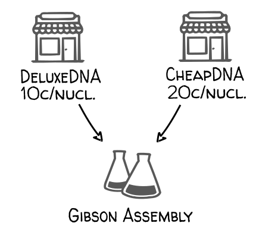

Cutting through the middle, 15c/nucleotide is a good choice of typical price. And indeed, the assembly station running an A\* search with this parameter will be more than 10 times faster, and find still find optimal solutions. A lower parameter value provides no speed advantage, and a higher value creates naive and expensive DNA assembly plans:

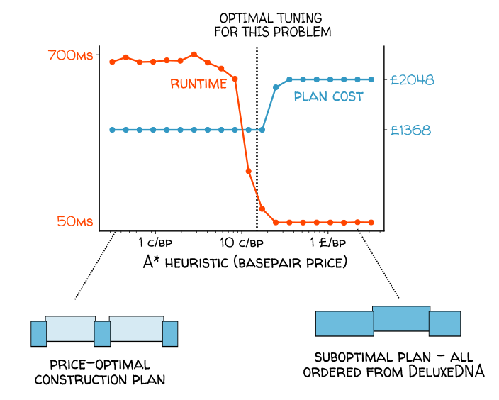

For problems with more sources it can get trickier, but you get the general idea. The important is that when the algorithm finds out that a 5000-nucleotide fragment of the sequence can be obtained virtually for free via PCR, it will understand that it is on a "fast lane" and that there are probably no other way but to use that free source. Let's come back to this problem:


As it turns out, the optimal price heuristic seems to also be ~15c/nucleotide, meaning, in a nutshell _"DeluxDNA or oligo assembly are considered expensive, look for alternatives when possible"_. With this setting for all stations, computing an assembly strategy for a 50,000-nucleotide sequence with E. coli homologies and a distribution of patterns go from 12 to 0.8 seconds, which is the difference between a long lag and a long click, between slow iterations by trial and error, and real-time price update as you edit your sequence:

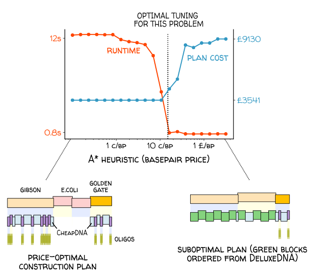

## Manufacturing fear is a mind-killer

Fifty years ago, synthesizing a 50-mucleotide bit of DNA was a scientific achievement. Today a high-schooler can order a gene for a few hundred dollars. But for longer sequences we're not out of the woods yet. It will take time to plan, it will hit your budget, and in some cases the success is not even guaranteed. I've seen this being a big factor of project paralysis in Synthetic Biology, with researchers pondering their options, planning their orders for months before taking a leap.

Add to this that five years from now, commercial DNA offers, cloning techniques, and even the nature of projects will be different (I didn't scrape the surface of combinatiorial assembly, multiplexed PCRs, genome editing, and many other subjects I know less about), which makes it a lot of work for software teams to keep up with software tools. All this to say that if you are into algorithms and bioengineering, there should be plenty to do.
