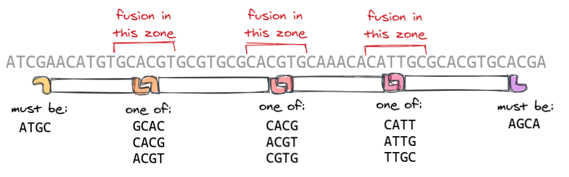

---

> _**Note:** I simplified technical terms and details whenever possible to keep this post focused on the design problems and accessible to a larger audience._

---

or only to come up with it
If you want to stitch more than 2 bits of DNA together, the most popular method these days is probably Golden Gate Assembly. In a nutshell, you mix DNA fragments in a tube where enzymes will cut their flanks to create _overhangs_ (also called _sticky ends_), then fuse the overhangs together to form the desired DNA construct:


How do we know that the DNA parts will assemble in the expected order A-B-C-D, and not C-A-B-D or D-A-C-B ? This is because their DNA sequences are designed so that the 4 nucleotides at the end of each part match the 4 nucleotides at start of the next part, like in a game of dominos:


Let's have a closer look at Parts A and B. Each has two strands, with the lower strand being the _complementary_ of the upper one ("T" complements "A", and "G" complements "C"):


When the flank-cutting enzyme cuts the right flank of Part A, it leaves an overhang of four "bare" nucleotides on the lower strand. When it cuts the left flank of Part B, it leaves another overhang, this time on the upper strand:


The two ends are perfectly complementary and will be fused to form a single DNA molecule:


Bioengineers can assemble many parts at once using this method -- typically 10, 20, or even 30+ parts for the most ambitious projects. But as the number of parts increases, so does the difficulty of finding overhang sequences that play well together.

## Rules of the game

Throughout the DNA assembly protocol, several copies of each part are freely floating around in the assembly mix:


One thing we really want to avoid here is the accidental fusion of parts that were not meant to fuse together, which would create "monster" DNA molecules and prevent the formation of the desired construct. To this end, a few logical rules must be observed.

**Design rule #1**

Don't use the same overhang sequence for different part fusions. If the overhang that fuses Part A to B is the same that fuses Part C to D, then two varieties of constructs will be formed, one of which is missing parts B and C. Yikes!


**Design rule #2**

Beware of reverse-complementary overhangs! In the example below, each fusion is using a different overhang sequence, which looks great. But notice that the right overhang of Part C, once flipped over, is actually complementary to the right overhang of Part A:


This is bad because many copies of Parts A and C will be lost in this useless fusion. Other copies of the parts may still assemble in the right order to produce the expected construct, but the probability of success will be decreased.

**Design rule #3**

Don't use overhang sequences that are their own reverse-complements. For instance if a part has a CATG overhang then different copies of this part can fuse together, resulting here again in a waste of fragments and lower assembly success rates.


### Pop quiz!

**Problem 1**

According to the rules above, which letter should replace the X?


**Problem 2**

Is this overhang set valid? List the reasons why not.


**Problem 3**

Let's throw some real-world shade! What would you improve in the overhang design of the [Ecoflex](https://pubs.acs.org/doi/10.1021/acssynbio.6b00031) bacterial engineering standard? (you don't need to understand the figures to answer, simply look at the overhang sequences).


**Still too easy?**

If these small examples made you hesitate for a few seconds, imagine how it feels to design a collection of 20+ overhangs from scratch, where checking the compatibility of all overhangs and their reverse-complements takes hundreds of pair-wise comparisons. After hours (if not days) of careful design, you may still make a few mistakes that will end up costing you weeks of work and thousands of dollars down the line! But wait, it gets worse.

## Advanced rules for advanced players

Real-life DNA assembly projects generally come with their own extra constraints and cave-ats. This section will be a bit more technical, but you can also just glance over and head to the next section on computational resolution.

**Extra rule #1**

Some overhang sequences can be imposed. This typically happens when you already have genetic parts in the fridge that use overhangs ATGC, AATC and GGCA, and you want the next overhangs you design to be compatible with these, so that old and new parts can be assembled in the same constructs.

Other constraints arise when designing overhangs that will appear at biologically significant locations of the final construct. For instance, in the Phytobrick standard for plant engineering, the DNA parts represent different functional modules of a same gene, with one part encoding a protein, and other parts encoding flanking "tags" (which are biological markers that will send a signal to the cell or the biologist):


Notice that the second overhang `AATG` is at the very beginning of a coding sequence, which is why it contains `ATG`, the sequence of the Methionine _start codon_. In the next overhang, `AGCC`, the `GCC` codes for Alanine, a very small amino-acid commonly used in "chains" linking proteins and tags together. Likewise , `TCG` in the next overhang codes for Serine, another small amino-acid used in chains. All other overhang sequences in the standard (not shown here) have therefore had to be designed to be compatible with these imposed sequences.

**Extra rule #2**

No scars! In the most flexible bioengineering projects, you are allowed to add a few nucleotides here and there in the desired sequences to make them easier to assemble from parts. These added nucleotides with no function other than to enable construction are called "assembly scars".

In more demanding bioengineering projects, the desired sequences are so biologically significant and tightly designed that they absolutely cannot be modified -- they don't allow scars. For your assembly, this means that the overhang sequences _must_ be part of the desired final construct sequence:


This constraint still leaves some choice in the overhang sequences. For instance we could decide that the first fragment should fuse with the second fragment _somewhere_ in a certain 6-nucleotide region, which gives us 3 options depending on where exactly the fusion occurs:


Each overhang of the assembly will be picked from a different region of the final sequence, and so will have its own set of options, making the design overhang problem look like this:



The example above is a bit underwhelming, but biologists have managed some really impressive scarless assemblies: the schema below describes how [Tsuge et al., (2015)](https://www.nature.com/articles/srep10655) assembled a whole _phage virus_ genome of ~50,000 nucleotides in a single operation, by stitching together 50 fragments of ~1000 nucleotides each. This required crazy tweaks to the assembly protocol, but also the selection of 50 fully inter-compatible overhangs located ~1000 nucleotides apart in the phage's genome. Such a great assembly design!


**Extra rule #3**

Take into account the imperfections of the ligase (the enzyme that fuses part ends together). For instance the ligase is very bad at fusing sticky ends `AAAA` and `TTTT` together, even though they are perfectly complementary, so these sequences should be avoided in your overhang sets. As another example, the ligase can mistakenly fuse together parts with overhangs `GGCG` and `GGCC` because, while different, they are not _different enough_ in the eyes of the enzyme.

In the first years at the Edinburgh Genome Foundry we used simple rules of thumb to avoid mis-fusions:

- Only use overhang sequences with at least one "A/T" and one "G/C".
- All pair of overhangs (and their reverse complements) should differ by at least two nucleotides if possible.

These rules worked pretty well. They were first used in the design of the EMMA standard (25-part assemblies of mammalian genetic constructs, [Martella et al. 2017](https://pubs.acs.org/doi/10.1021/acssynbio.7b00016)) and at some point we even managed a 35-part assembly, which was very painful but may have been a Golden Gate world record at the time.

More recently [Potapov et al (2018)](https://pubs.acs.org/doi/10.1021/acssynbio.8b00333) mapped exactly which overhangs could be mistakenly fused together and with which frequency (in the figure below, anything outside of the main diagonals is an unwanted fusion between different overhang sequences), providing incredibly useful data that they later used to assemble up to 40 DNA parts together!


## It's a computer game after all

When things get that complicated, a computer script can go a long way.

The most intuitive algorithm to generate a set of valid overhangs is constructive (_branch and bound_): you start with a single overhang, add another one compatible with the first, then a third one compatible with the first two, and so on. When you cannot add any new overhang, you can try to _backtrack_ (remove one overhang here, add another one there...) in the hope of finding an even better overhang set.

This seems to be the approach taken in NEB's GetSet app ([Pryor et al 2020](https://journals.plos.org/plosone/article?id=10.1371/journal.pone.0238592)). It works well for reasonably sized assemblies, but if you need to find 20+ compatible overhangs the method may rtake some time, and is not guaranteed to produce a large enough overhang set.

As DNA overhang design was an important part of my job at the Edinburgh Genome Foundry and customers kept coming up with difficult problems, I started a Python library called [GoldenHinges](https://github.com/Edinburgh-Genome-Foundry/GoldenHinges) with different approaches which I'll explain below.

### A slick clique trick

In this approach, you first list all the overhangs that you'll allow yourself to use. For instance, all overhangs which have at least one G-or-C and one A-or-T, and are compatible with overhangs ACTC,AGGC, and GATG. You generally end up with a restricted set of possible overhangs:


Next, you draw an edge between each pair of overhangs that are compatible according to your criteria, which can be for instance _"any two overhangs and their reverse-complements must have at least 2 different nucleotides"_ :


Now any valid set of overhangs (where all overhangs are inter-compatible) corresponds to a subset of the graph where every pair of nodes is connected by an edge, also known as a graph _clique_ (like your _clique_ of friends in the Facebook friendship graph):


The good news is that clique finding has been the bread and butter of graph theorists for a long time, and they have come up with sophisticated algorithms to quickly spot the best and largest cliques of a graph (see Bron-Kerbosch or Tarjan-Trojanowski, to cite only the ones with the most impressive names).

It can be daunting to go through all the literature and understand the subtleties of each approach, but I have a PhD in Applied Mathematics, so I googled _"python clique finding"_ and used whichever library the first link told me to. Turns out the excellent Networkx library has all the methods we need! For instance this ~10-line snippet generates a collection of 32 compatible overhangs with 75% G/C:

```python
import networkx, itertools, easy_dna

overhangs = [
    overhang
    for overhang in easy_dna.all_iupac_variants("NNNN")
    if len([c for c in overhang if c in "GC"]) == 3  # 75% GC
]
compatible_overhang_pairs = [
    (o1, o2)
    for (o1, o2) in itertools.combinations(overhangs, 2)
    if o1 != o2 and (o1 != easy_dna.reverse_complement(o2))
]
graph = networkx.Graph(compatible_overhang_pairs)
max_clique, clique_size = networkx.max_weight_clique(graph, None)
print (max_clique)
# > ['TCCC', 'ACGC', 'CGTC', ... 'GACC']
```

### Have a constraints problem? Try a constraints solver!

The clique trick is great for finding new sets of compatible overhangs, but it cannot be applied to sequence decomposition problems where each overhang must be drawn from a different set, like this one:


The only solutions I've seen in the literature were written for the J5 framework ([Hillson et al 2011](https://pubs.acs.org/doi/pdf/10.1021/sb2000116)) and the 50,000-nucleotide phage assembly mentioned above ([Tsuge et al. 2015](https://www.nature.com/articles/srep10655)), and both use custom-written _branch-and-bound_ algorithms. A low-effort way to leverage sophisticated branch-and-bound algorithms is to use a constraint programming framework, by translating the problem into rules that the framework understands:

- _"I have 5 variables V1, V2, V3, V4, V5 representing the overhang sequences."_
- _"V2 can only take the values GCAC, CACG, and ACGT"_
- _"Here is the list of the only compatible sequences for the (V2, V3) overhangs pair"_.

Which for the [Google OR tools](https://developers.google.com/optimization/cp) framework translates to:

```python
from ortools.sat.python.cp_model import  CpModel, CpSolver, Domain

# Problem definition
model = CpModel()
choices = dict(
    V1=["ATGC"],
    V2=["GCAC", "CACG", "ACGT"],
    V3=["CACG", "ACGT", "CGTG"],
    V4=["CATT", "ATTG", "TTGC"],
    V5=["AGCA"]
)
variables = [
    model.NewIntVarFromDomain(Domain.FromValues(choice_list), name)
    for name, choice_list in choices.items()
]
for v1, v2 in itertools.combinations(variables, 2):
    model.AddAllowedAssignments((v1, v2), compatible_overhangs_pairs)

# Problem resolution
solver = CpSolver()
solver.Solve(model)
print ([solver.Value(var) for var in variables])
#> ['ATGC', 'ACGT', 'CGTG', 'ATTG', 'AGCA']
```

For the code above to fully work, you would need to convert each overhang sequence to a number, e.g. (AAAA→0, AAAC→1, ...) so ORTools can handle them -- this made the code harder to read so I left it as an exercise. You can also check out the [GoldenHinges library](https://github.com/Edinburgh-Genome-Foundry/GoldenHinges/blob/b4af31d671189956c55a3339a2946861a64e5f02/goldenhinges/OverhangsSelector.py#L154), which implements the same rules using the [Numberjack](https://github.com/eomahony/Numberjack) framework.

## Conclusion

Overhang design problems are in many ways characteristic of the field: simple at first glance, but with many gotchas that will ruin your project if you don't pay attention. They can be a thorn in the foot of whoever wants to extend an existing parts collection or assemble a scarless sequence, and they regularly get in the way of bioengineers' ambitions. But at the end of the day they can be resolved with simple scripts and well-established computational methods, which is a great win for applied maths.

If you were rooting against the biologist, don't worry: once past overhang design, there are many other ways an assembly project can tear someone's carreer and self-esteem to pieces. Some of these can still be prevented using yet other computational tools, which will be the subject of future posts.
